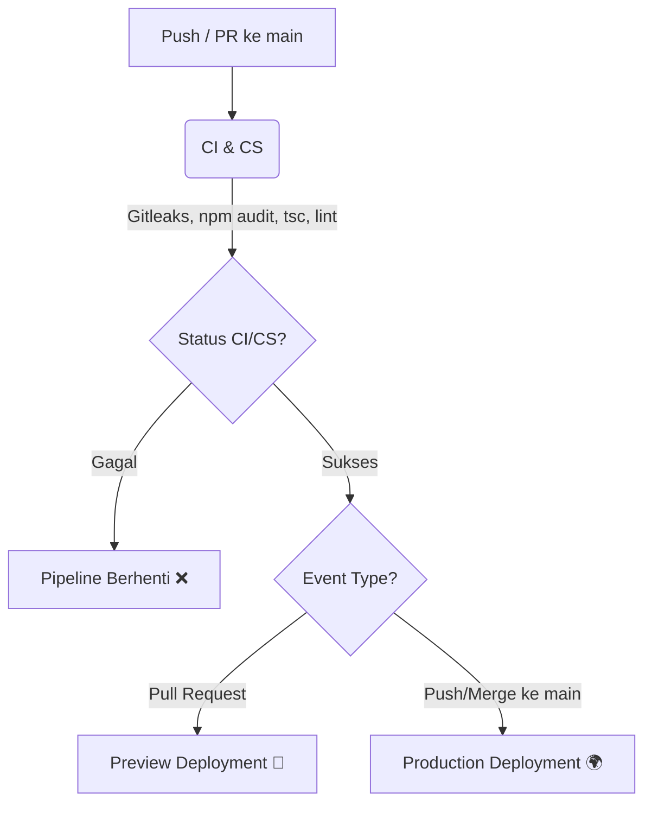

<div align="center">
  <h1>🏠 PAPAN</h1>
  <p>Platform Pencarian & Penyewaan Properti dengan Sistem Rekomendasi Cerdas (DSS)</p>
  
  <a href="https://papan-ppl-1.vercel.app" target="_blank">
    
  </a>
</div>

---

## 📖 Deskripsi Proyek

**PAPAN** adalah sebuah platform modern untuk mencari dan menyewakan properti (Rumah, Apartemen, dan Kosan). Aplikasi ini tidak hanya berfungsi sebagai *marketplace* properti biasa, tetapi juga dilengkapi dengan **Sistem Pendukung Keputusan (DSS)** yang memberikan personalisasi rekomendasi hunian kepada pencari berdasarkan kriteria bobot prioritas mereka (Budget, Lokasi, Fasilitas, dan Gender).

## ✨ Fitur Utama

- 👥 **Multi-Role Access**: Terdiri dari 3 peran utama: `USER` (Pencari), `OWNER` (Pemilik Properti), dan `ADMIN`.
- 🧠 **Sistem Rekomendasi (DSS)**: Mencocokkan properti terbaik berdasarkan profil personalisasi pengguna dan pembobotan kriteria cerdas.
- 🛡️ **Verifikasi Identitas (KYC)**: Keamanan ekstra dengan sistem verifikasi KTP dan Selfie untuk mencegah penipuan.
- 💬 **Interaksi Langsung (Chat)**: Fitur pesan *real-time* terintegrasi antara pencari dan pemilik properti.
- ⭐ **Review & Bookmark**: Pengguna dapat memberikan ulasan (beserta gambar) dan menyimpan properti favorit.
- 🚀 **Property Boost (Promosi)**: Pemilik dapat mempromosikan properti mereka agar tampil lebih atas menggunakan **Midtrans Payment Gateway**.
- 🗺️ **Peta Interaktif**: Pencarian properti berbasis lokasi menggunakan Leaflet.js.

## 🛠️ Teknologi (Tech Stack)

Proyek ini dibangun menggunakan teknologi *modern web development*:

- **Framework**: [Next.js](https://nextjs.org/) (App Router) & React
- **Styling**: Tailwind CSS v4
- **Database**: PostgreSQL (via Supabase)
- **ORM**: Prisma Client (`@prisma/client`)
- **Authentication**: NextAuth.js (Google OAuth & Credentials)
- **Payment Gateway**: Midtrans
- **Media Storage**: Cloudinary
- **Maps**: Leaflet & React-Leaflet
- **Testing**: Vitest
- **CI/CD**: GitHub Actions & Vercel

---

## 🚀 Menjalankan Proyek di Komputer Lokal (Development)

### 1. Persiapan Environment Variables
Duplikasi file `.env.example` menjadi `.env` lalu isi nilai-nilainya:
```bash
cp .env.example .env
```

**Kunci Rahasia Penting:**
- `DATABASE_URL` & `DIRECT_URL` (dari Supabase / PostgreSQL lokal)
- `NEXTAUTH_SECRET` 
- Credential Google OAuth, Cloudinary, SMTP (Nodemailer), dan Midtrans Server Key.

### 2. Instalasi & Setup Database
```bash
# Install dependencies
npm install

# Generate Prisma Client & sinkronisasi database
npx prisma generate
npx prisma db push

# (Opsional) Jalankan seed untuk data awal
npm run prisma:seed
```

### 3. Jalankan Server Dev
```bash
npm run dev
```
Buka [http://localhost:3000](http://localhost:3000) di browser Anda.

---

## ⚙️ CI/CS/CD Pipeline & Deployment

Repositori ini telah dikonfigurasi dengan otomatisasi *Continuous Integration*, *Continuous Security*, dan *Continuous Deployment* menggunakan **GitHub Actions** (`.github/workflows/pipeline.yml`).

### Alur Pipeline



---
*Dibuat untuk memenuhi kebutuhan Tugas Proyek Perangkat Lunak 1 (PPL-1).*
